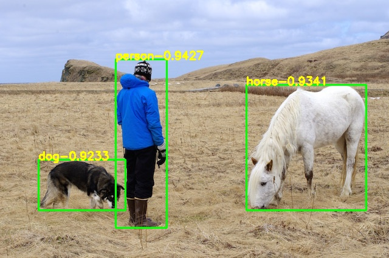
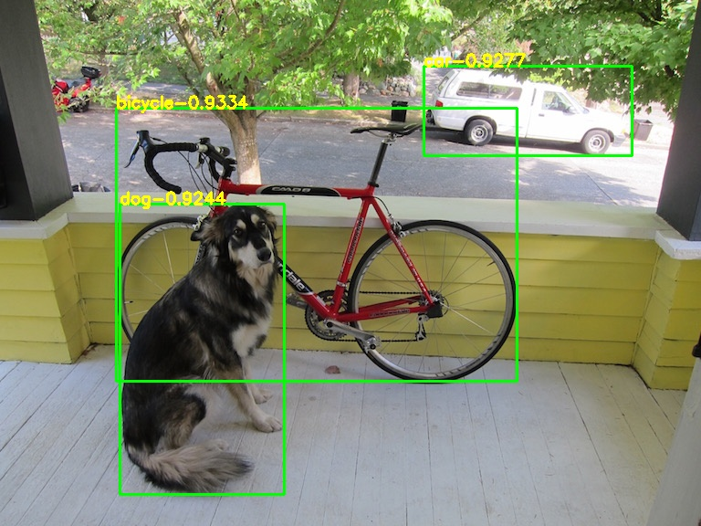
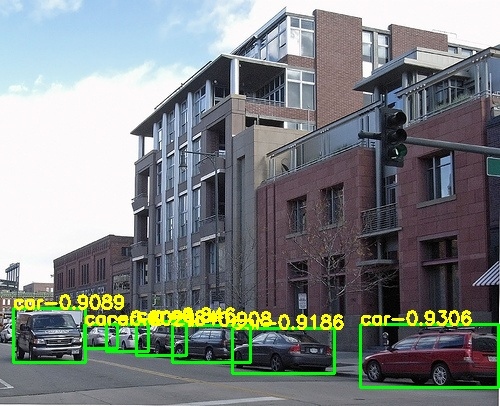

# YOLOV7_Train_PyTorch
1000行代码完美复现YOLOV7的训练和测试，精度、速度以及配置完全相同，两者模型可以无障碍相互转换

## 指标展示
|Model| train | test | mAP@0.5 | mAP@0.75 | batch 1 fps | tips |
|-----|------|------|-----|-----|-----|-----|
|yolov7(train from yolov7) | 0712 |	2007_test |	88.66 |	--- |	161 fps |	yolov5-loss, `Detect Head` |
|yolov7(train from yolov7) | 0712 |	2007_test |	88.89 |	--- |	161 fps |	yolov5-loss, `IDetect Head` |
|**yolov7(ours)** | 0712 |	2007_test |	**88.71** |	**76.80** |	**161 fps** | yolov5-loss, `Detect Head` |
|**yolov7(ours)** | 0712 |	2007_test |	**89.01** |	**76.85** |	**161 fps** | yolov5-loss, `IDetect Head` |

## 效果展示
      
      

## 使用说明
### 要求
> Python >= 3.6 \
> PyTorch >= 1.7
### 数据集下载
```shell script
cd <path-to-voc>/
wget https://pjreddie.com/media/files/VOCtrainval_11-May-2012.tar
wget https://pjreddie.com/media/files/VOCtrainval_06-Nov-2007.tar
wget https://pjreddie.com/media/files/VOCtest_06-Nov-2007.tar
tar xf VOCtrainval_11-May-2012.tar
tar xf VOCtrainval_06-Nov-2007.tar
tar xf VOCtest_06-Nov-2007.tar
```
### 数据生成
```shell script
cd data/voc0712
python voc_label.py
cat 2007_train.txt 2007_val.txt 2012_*.txt > train.txt
```
### 预训练模型下载
[yolov7_samylee.weights(提取码8888)](https://pan.baidu.com/s/1UYZR4QV_WaWBJBWg0lxZVw)

### 训练和测试
```shell script
Detect mode: set `deploy=True`
IDetect mode: set `deploy=False`

python train.py
```
已训练好的模型：  
[DetectMode(提取码:8888)](https://pan.baidu.com/s/1Z4CIdiopQSFodpR4RopqSw)  
[IDetectMode(提取码:8888)](https://pan.baidu.com/s/1EU8Sj1ViLURF1ZS6LIM2-g)  
```shell script
python detect.py
```
### 计算mAP
模型转换至darknet
```shell script
python cvt2darknet.py
```
编译原始版本[darknet](https://github.com/AlexeyAB/darknet)
```shell script
./darknet detector map cfg/voc.data cfg/yolov7_samylee.cfg weights/yolov7-50.weights
```

## 参考
https://blog.csdn.net/samylee  
https://github.com/AlexeyAB/darknet  
https://github.com/WongKinYiu/yolov7
